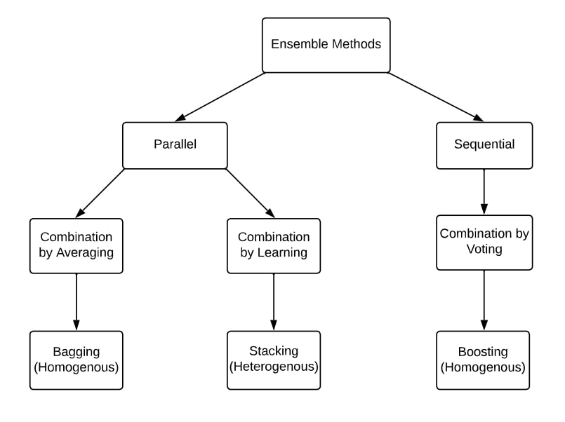

This article will give you a basic understanding of Ensemble Methods. The article will also go on to discuss ways to improve Ensemble Methods performances. So, let’s dive right in.
*Note: This article reading requires the reader to be familiar with the basic machine learning concepts like training models, bias and variance.

## Introduction 
Imagine you find yourself in a foreign city or country and have no place to spend the night. You decide to book a hotel online and found yourself two suitable hotels nearby both having the same review rating. However, the first hotel was rated by only one person and the second one by 100 people. Which of these hotel ratings would you trust more and eventually which hotel would you chose to stay in? The answer for most people is straightforward. 100 people opinion is definitely much stronger and trustworthy than only one person. This superiority is referred to as the “wisdom of the crowd” and is the same reason why ensemble methods work so well.

## Ensemble methods

Ordinarily, we make only one learner (learner == trained model) from the training data (i.e., we train only one machine learning model on our training data). However, ensemble methods make multiple learners to solve the same problem and then combine them together. These learners are called the base learners and can have any underlying algorithm like neural networks, support vector machines, decision trees etc. If all of these base learners consist of the same algorithm then they are called homogenous base learners while if they are made from different algorithms then they are referred as heterogenous base learners. The ensemble is able to generalize much better than the individual base learners leading to better results.

Ensemble methods work well when they are comprised of weak learners i.e., the base learners chosen are models that make predictions a little better than a random guess, roughly speaking. (i.e., they have high variance and/or high bias). For this reason, base learners are sometimes referred to as weak learners. And ensembled model or strong learner (which is a combination of these weak learners) has a lower bias and/or variance and attains improved performance. This ability of ensemble methods to turn weak learners into a strong learner is the reason that they gained so popularity because in practice it is much easier to obtain a weak learner.

In recent years, ensemble methods have consistently managed to win online competitions like KDD orange cup, Netflix price etc. In addition to the online competitions, ensemble methods have also been applied in real life applications like computer vision branches of object detection, recognition and tracking etc.

## Main Types of Ensemble Methods ##

Now there are two important questions need to be answered to classify different ensemble methods. How are these weak learners generated and how are they combined? Since the purpose of this article is to give you an overall picture, we will only scratch the surface of these questions without going into too much details.

### How weak learners are generated?

Ensemble methods can be divided into two broad categories depending on how base learners are generated, Sequential ensemble methods and Parallel ensemble methods. As the name suggests, in the Sequential ensemble methods, the base learners are generated sequentially and then combined for prediction, for example Boosting algorithms like AdaBoost. While in Parallel ensemble methods the base learners are generated in parallel and then combined for prediction, examples of which are Bagging algorithms like random forest and Stacking algorithm. The diagram below shows a simple architecture explaining parallel and sequential methods.

The sequential methods exploit the dependence between the weak learners, and boost the overall performance in a residual-decreasing way where the later learners focus more on the mistakes of the earlier learners. Roughly speaking (for regression problems), the error decrease of ensembled model made by boosting is achieved by reducing mainly the high bias of the weak learners although sometimes decrease in variance is also observed. On the other hand, the parallel ensemble methods decrease the error by combining independent weak learners i.e., it exploits the independence between the weak learners. Roughly speaking, this error decrease is due to the decrease in variance of the model. So, we can generalize that boosting decreases error by reducing mainly the bias of the model while bagging decreases error by reducing the variance of the model. This is important as the choice of which ensemble method to choose will depend on if the weak learners have high variance or high bias.

### How are weak learners combined?

After generating these so-called base learners, we do not choose the best of these learners but rather combine them together for better generalization and the way we do it plays a big part in Ensemble Methods.

Averaging: The most common way to combine the base learners when the output is numeric is by Averaging. The averaging can be simple averaging or weighted averaging. For regression problems, simple average would be the sum of the errors of all the base models and dividing by the total learners. In weighted average, however, the combined output is achieved by giving different weights to each base learner showing different importance. For regression problem, we would multiply the error of each base learner with its assigned weight and sum them up.

Voting: For nominal outputs, Voting is the most used way for combining the base learners. The voting can be of different types like majority voting, plurality voting, weighted voting and soft voting. For classification problems, the majority voting gives each learner one vote where they vote for one of the class labels. Whichever class label receives more than 50% of the votes is the predicted outcome of the ensemble. However, if none of the class label receives more than 50% votes than a rejection option is given which means that the combined ensemble fails to make any prediction. In plurality voting the class label which receives the highest number of votes is the predicted outcome and more than 50% votes is not a requirement for the class label. It means if we have three output labels and all three receives less than 50% votes lets says 40%,30%,30%. Then the class label with the 40% votes will be the predicted outcome of the ensemble model. Weighted voting, just like weighted averaging, assigns weights to the classifier depending on their importance and how strong is the particular learner. Soft voting is used for class outputs which are probabilities (values between 0 and 1) rather than labels (binary or otherwise). Soft voting is further divided into simple soft voting (where a simple average of probabilities is taken) and weighted soft voting (where weights are assigned to learners and probabilities multiplied with these weights and summed up).

Learning: Another way of combination is combining by Learning which is what stacking ensemble methods uses and this is mainly what differentiate bagging from stacking (both of which are parallel sequencing ensemble methods as mentioned before). In this method a separate learner called the meta-learner is trained on a new dataset to combine other base/weak learners generated from original dataset.

There are many other, less common, combination methods which are out of the scope of this article.

Note that all three Ensemble methods whether it is boosting bagging or stacking can be generated either using homogenous or heterogenous weak learners. However, the most common practice is of using homogenous weak learners for Bagging and Boosting and heterogenous weak learners for Stacking. The diagram below does a good job roughly classifying the three main ensemble methods.

## Ensemble Diversity

Ensemble Diversity refers to how much different are the base learners from one and another and it has a great significance in generating good ensemble models. Logically, just as we need different opinions from people to reach a good/optimal decision, we need base learners that are different from one and another to achieve a good performance of the Ensembled model. In the literature, it has been theoretically proved, through different combination methods, that fully independent (diverse) base learners lead to maximum decrease in error while fully (highly) correlated learners will not result in any improvement. Although it sounds simple, this is a challenging problem in real life as we are training all the weak learners to solve the same problem by using the same dataset which results in high correlation. In addition to that, we need to make sure that the weak learners are not really poor models because that may even lead to worsened performance of the ensemble as proved by many researchers. On the other hand, combining base learners which are all very strong and accurate rather than weak may also not result in as good performance as combining some weak and some strong learners. So, a balance is necessary between how accurate the base learners are and how diverse the base learners are compared to each other. The concept of diversity holds great significance in Ensembled Methods and researchers are doing continual efforts to understand the concept of diversity more. Some techniques to achieve ensemble diversity are given below.

How to achieve Ensemble Diversity?

### Data Manipulation

We can divide our dataset into subsets to be used in the base learners. If the dataset is big we can simply divide the dataset into equal parts to be fed into the model. If the dataset is small we can use random sampling with replacement to generate new datasets from the original dataset. Bagging methods uses bootstrapping technique to generate new datasets which is basically random sampling with replacement. Through bootstrapping we are able to create some randomness as all the datasets generated must have some different values. However, note that most of the values (around 67% according to theory) will still be repeated and hence the datasets would not be completely independent.

### Input Feature Manipulation

All datasets contain features which provide information about the data. Instead of using all features in one model we can create subsets of features and generate different dataset and feed it into the model. This approach is adopted by random forest technique and is effective when a lot of redundant features are present in the data. The effectiveness decreases when there are very few features in the dataset.

### Learning Parameter Manipulation

This technique generates randomness in the base learners by applying different parameter settings for the base learning algorithm i.e., hyperparameter tuning. For example, different initial weights can be assigned to individual neural networks by changing the regularization term.

## Ensemble Pruning

Finally, the technique of Ensemble Pruning helps in some cases to achieve better performance of the ensemble. Ensemble Pruning means that instead of combining all the weak learners we combine only a subset of learners. This can lead to even better performance as sometimes “Few are better than all”. In addition to that, smaller size of ensemble saves storage and computational resources hence improving efficiency.

## Conclusion

Ensemble Methods in machine learning are a world of their own. In this article, you have just put one step inside this world. And I urge you to explore this world more by conducting thorough research and more importantly by applying the research to real life problems.

Thank you for reading!
If you like it, please follow me for more upcoming posts on Data Science and Machine Learning!

### References

[International Statistical Review Vol. 81 Iss. 3] Nordhausen, Klaus — Ensemble Methods_ Foundations and Algorithms by Zhi-Hua Zhou (2013)